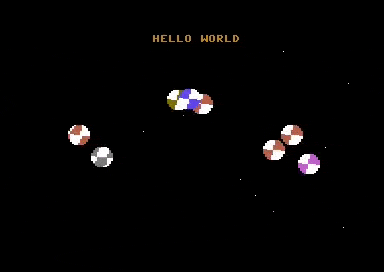

# C64 C++ Demo

Demos for the Commodore C64 written in C++ 20 using Clang for 6502/6510, C using CC65 and 6502 assembler using ACME.

<table><tr>
  <td style="padding: 20px; padding-right: 40px;"></td>
</tr></table>

- Animated sprites
- Scrolling starfield
- Raster interrupt handling
- SID music
- NMI digi sample playback

## Setup

- For development and building, please install the VS64 extension for Visual Studio Code. (https://marketplace.visualstudio.com/items?itemName=rosc.vs64)
- For best performance, switch the build mode to "release" to turn on code optimization. This makes a significant difference!
- To edit the sprites and charsets, the tools CharPadPro and SpritePadPro need to be installed (Windows only)
- For C++, the LLVM-MOS development environment needs to be installed. (https://github.com/llvm-mos/llvm-mos-sdk)
- For plain C, the CC65 compiler needs to be installed. (https://cc65.github.io)
- For 6502 assembler, the ACME Cross-Assembler needs to be installed. (https://sourceforge.net/projects/acme-crossass)

## Further Notes

### Additional Toolkits

Not covered yet, but fyi - VS64 also supports the Kick Assembler toolkit. Porting the ACME version of the demo should be very straight forward to do. (http://theweb.dk/KickAssembler)

### Additional Content

For convenience, simplified versions of the demo for the CC65 compiler and the ACME assembler are included.

### SID Music

GoatTracker2 SID Generation Parameters

- gt2reloc music.sng music.sid -B0 -D0 -E0 -H0 -C0 -I1 -J0 -W50 -ZFE
