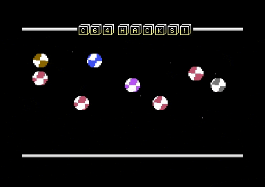

# C64 C++ Demo

Demo for the Commodore C64 written in C++ 20 using Clang for 6502/6510.

<table><tr>
  <td style="padding: 20px; padding-right: 40px;"></td>
</tr></table>

- Animated sprites
- Scrolling starfield
- SID music
- Raster interrupt handling
- C64 system programming SDK

## Setup

- For development and building, please install the VS64 extension for Visual Studio Code. (https://marketplace.visualstudio.com/items?itemName=rosc.vs64)

- For best performance, switch the build mode to "release" to turn on code optimization. This makes a significant difference!

-  The LLVM-MOS development environment needs to be installed. (https://github.com/llvm-mos/llvm-mos-sdk)

- To compile the additional examples for CC65 and the ACME assembler, the relevant toolkits need to be installed.

- To edit the sprites and charsets, the tools CharPadPro and SpritePadPro need to be installed (Windows only)

## Further Notes

### Additional Content

For convenience, simplified versions of the demo for the CC65 compiler and the ACME assembler are included.

### SID Music

GoatTracker2 SID Generation Parameters

- gt2reloc music.sng music.sid -B0 -D0 -E0 -H0 -C0 -I1 -J0 -W50 -ZFE
